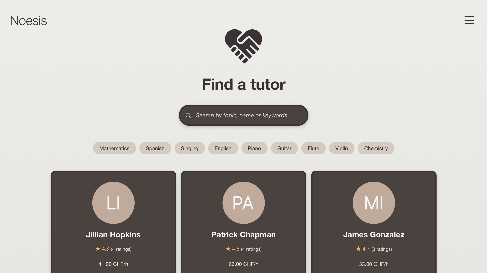

# Noesis

Noesis is a full-stack web-based tutoring platform to facilitate student-tutor matching.



## Tech Stack

- **Backend**: Django, Django REST Framework
- **Frontend**: React
- **Database**: PostgreSQL
- **Containerization**: Docker

## Features

- **User Authentication**: Secure, role-based registration and login system with JWT authentication
- **Homepage**: Search and filter tutors, view their tutor cards
- **Profile**: Comprehensive profile editing with specialization options 
- **Booking**: Flexible session booking for online (webcam) or in-person tutoring, tailored to tutor availability
- **Reviews & Ratings**: Submit and view tutor reviews
- **Messaging**: Direct communication between students and tutors
- **Notifications**: Real-time, contextual updates for bookings, messages, and session reminders
- **Sessions**: Manage sessions, status tracking (pending, confirmed, completed, etc.)
- **Settings**: Change email, change password, delete account

## Prerequisites

- **Docker** (https://www.docker.com/get-started)
- **Docker Compose** (https://docs.docker.com/compose/install/) - Usually included with Docker Desktop

## Running with Docker 

1. Clone the repository and navigate to the project directory:
```bash
git clone https://github.com/mihcaoj/noesis.git
```
```bash
cd noesis
```

2. Make the setup script executable and run it:
```bash
chmod +x setup.sh
```
```bash
./setup.sh
```

3. Access the application:

   - **Frontend**: http://localhost:3000 (username: admin, password: admin123 or register)
   - **Backend API**: http://localhost:8000
   - **Admin Panel**: http://localhost:8000/admin (username: admin, password: admin123)

After the initial setup, if for some reason you wish to reset the database and start fresh:
```bash
./setup.sh --reset
```

## Project Structure

```
noesis/
│
├── backend/                      
│   ├── core/
│   │   ├── management/           # Custom management commands                    
│   │   ├── migrations/           # Database migrations
│   │   ├── admin.py              # Django admin configuration
│   │   ├── apps.py               # App configuration
│   │   ├── models.py             # Database models
│   │   ├── serializers.py        # REST API serializers
│   │   ├── views.py              # API views and endpoints
│   │   ├── signals.py            # Django signals
│   │   └── urls.py               # URL routing
│   ├── media/profile_pictures/   # User uploaded profile images
│   ├── noesis/                   
│   │   ├── asgi.py
│   │   ├── settings.py           # Django settings
│   │   ├── urls.py               # Project-level URL routing
│   │   └── wsgi.py
│   ├── manage.py                 # Django management script
│   └── populate_app.py           # Database seeding script
│
├── frontend/                     
│   ├── public/                   # Static files
│   ├── src/                      
│   │   ├── components/           
│   │   │   ├── Common/           # Shared components
│   │   │   ├── Forms/            # Form components
│   │   │   ├── Layout/           # Layout components
│   │   │   └── Modules/          # Feature-specific components
│   │   ├── pages/                
│   │   │   ├── Auth/             # Authentication pages (Login and Register)
│   │   │   ├── Home/             # Homepage
│   │   │   ├── Messages/         # Messaging interface
│   │   │   ├── Notifications/    # Notifications center
│   │   │   ├── Profile/          # User profiles
│   │   │   ├── Sessions/         # Session management
│   │   │   └── Settings/         # User settings
│   │   ├── routes/               # Route definitions
│   │   ├── services/             # API service layer
│   │   ├── styles/               # CSS files
│   │   ├── utils/                # Utility functions
│   │   ├── App.js                # Main application component
│   │   └── index.js              # Entry point
│   ├── package.json              # Dependencies and scripts
│   └── Dockerfile                # Frontend container definition
│
├── docker-compose.yml            # Container orchestration
├── Dockerfile                    # Backend container definition
├── setup.sh                      # Development setup script
├── README.md                     # Project documentation, you are here ;) 
└── requirements.txt              # Dependencies
```
